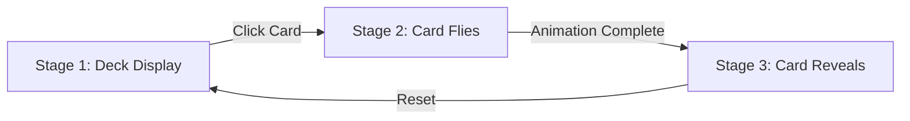

# 🔮 Vibe Tarot - Interactive Tarot Card Experience

An immersive, animated tarot card reading application built with React, TypeScript, and Framer Motion. Experience the mystical art of tarot with smooth animations and interactive card selections.


## 🚀 Getting Started

### Prerequisites

| Requirement | Version |
|-------------|---------|
| Node.js | >= 18.x |
| Bun | Latest |

### Installation

```bash
# Clone the repository
git clone <your-repo-url>

# Navigate to project directory
cd react-vibe-tarot

# Install dependencies
bun install

# Start development server
bun run dev

# Build for production
bun run build

# Preview production build
bun run preview
```

### Available Scripts

| Command | Description |
|---------|-------------|
| `bun run dev` | Start development server with hot reload |
| `bun run build` | Build for production |
| `bun run lint` | Run ESLint for code quality |
| `bun run preview` | Preview production build locally |

## 🎴 Component Overview

### Core Components

| Component | File | Responsibility |
|-----------|------|----------------|
| **MyTarotSection** | `index.tsx` | Main container with background and layout |
| **Deck** | `Deck.tsx` | Animation stage management and card orchestration |
| **DeckList** | `DeckList.tsx` | Renders the deck of cards in a fan layout |
| **MotionFlyCard** | `MotionFlyCard.tsx` | Handles individual card flight animations |
| **TarotCard** | `TarotCard.tsx` | Displays tarot card with flip animation |

### Component Hierarchy

```
App
└── MyTarotSection
    └── Deck
        ├── DeckList
        │   └── MotionFlyCard (multiple)
        └── TarotCard (multiple, stage 3)
```

## 🎬 Animation Stages

The application uses a three-stage animation system:

| Stage | Name | Description | Duration |
|-------|------|-------------|----------|
| **Stage 1** | Initial Deck | Cards displayed in a fan formation | - |
| **Stage 2** | Card Flight | Selected cards fly to center position | 1.5s |
| **Stage 3** | Card Reveal | Cards flip and spread in final positions | 0.8s |

### Stage Flow



### Animation Timing

| Animation | Timing | Easing |
|-----------|--------|--------|
| Card flight | 1.5s | easeInOut |
| Card flip | 0.8s | easeInOut |
| Fade transitions | 0.5s | linear |
| Hover effects | 0.3s | ease |

## 💻 Development

### Key Features Implementation

#### 1. Card Selection System
- Click any card in the deck to select it
- Multiple cards can be selected (configurable)
- Selected cards are tracked by index

#### 2. Animation Orchestration
- Uses `useGSAP` hook for timeline management
- Refs for precise element targeting
- Framer Motion for smooth transitions


## 📦 Dependencies Overview

### Production Dependencies

| Package | Purpose |
|---------|---------|
| `framer-motion` | Animation library |
| `tailwindcss` | Utility-first CSS framework |
| `lucide-react` | Icon components |
| `class-variance-authority` | Component variant management |
| `clsx` & `tailwind-merge` | Conditional class merging |

